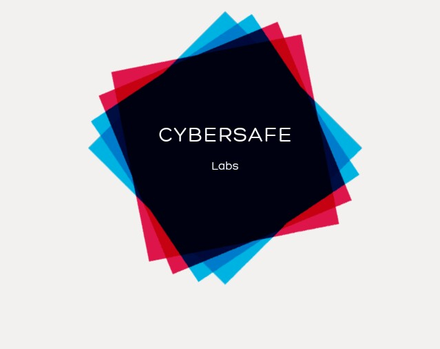

### Hi there 👋

I am Aditya Patil 10 year-old software developer and Cybersecurity Student:

- 🔭 I’m currently working on EcoOS, CodeHub, Kwick Browser (Released), <a href="cybersearch.herokuapp.com">CyberSearch: A Search Engine written in Python and scrapes results from Bing and Wikipedia.</a> and <a href="https://cyberencryptca.github.io/website/">CyberEncrypt CA: An Open-Source Free Certificate Authority</a><a href="https://github.com/CyberEncryptCA/certificates"> View Source Code</a> And my lateset project Comma: An open-source high performence RISC V processor. Currently My Most Ambitious Project: Avion ( An open source, powerful and commercial electric jet engine ) Work in Progress! (edit: Dont expect this to be out soon, as this is in it's critical desgin stage and may take years of desgins before there might be a prototype of Avion can be made! Also I will release the blueprints and any code I may use when they are ready. Until Then Happy Coding ! :D)
- 🌱 I’m currently learning Cybersecurity, JavaScript, Node.js and ReactJS
- 👯 I’m looking to collaborate on Python and HTML projects
- 🤔 I’m looking for help with Eco OS
- 💬 Ask me about Python and HTML
- 📫 How to reach me: <a href="mailto:admin@cybersafe.ezyro.com">E-Mail</a> <a href="http://www.cybersafe.ezyro.com">Website</a> <a href="http://www.cybersafe.ezyro.com/contact">Contact Form</a>
- ⚡ Fun facts: 'CEO' Of CyberSafe Labs, Inc. Crushes on: [ REDACTED ]
- ⚡ Note: Bionic has been transfered to Eakyns/Bionic (Bionic is a continuation of my previous project Comma (A high-performence RISC-V Processor) )
-->
- ⚡ Stats:

# Favourite Repos

